# Praktikum 1: PHP Framework (Codeigniter)

## Tujuan
1. mahasiswa mampu memahami konsep dasar Framework.
2. Mahasiswa mampu memahami konsep darae MVC.
3. Mahasiswa mampu membuat program sederhana menggunakan Framework Codeigniter4.

## Langkah - langkah Prakyikum
### 1. Persiapan Server Requirements
Sebelum memulai, pastikan perangkat lunak pendukung sudah sesuai dengan standar minimum agar farmework dapat berjalan:
1. Versi PHP: Gunakan versi 8.2 atau yang lebih baru.
2. Ekstensi PHP: Pastikan ekstensi intl, mbstring, json, mysqlnd (untuk database), dan libcurl sudah aktif di konfigurasi PHP anda.

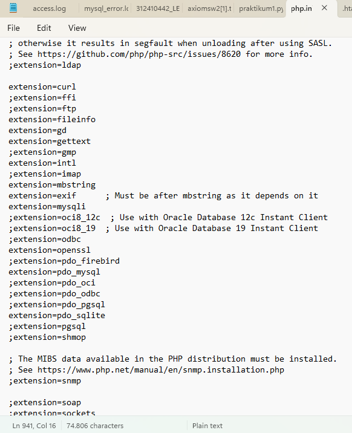

### Instalasi Condeigniter4
Untuk melakukan instalasi  Codeigniter 4 kita akan menggunakan cara manual dengan mengunduh dari website https://codeigniter.com/download  
• Extrak file zip Codeigniter ke direktori htdocs/lab11_ci.
• Ubah nama direktory framework-4.x.xx menjadi ci4. 
•Buka browser dengan alamat http://localhost/lab11_php_ci/ci4/public/  

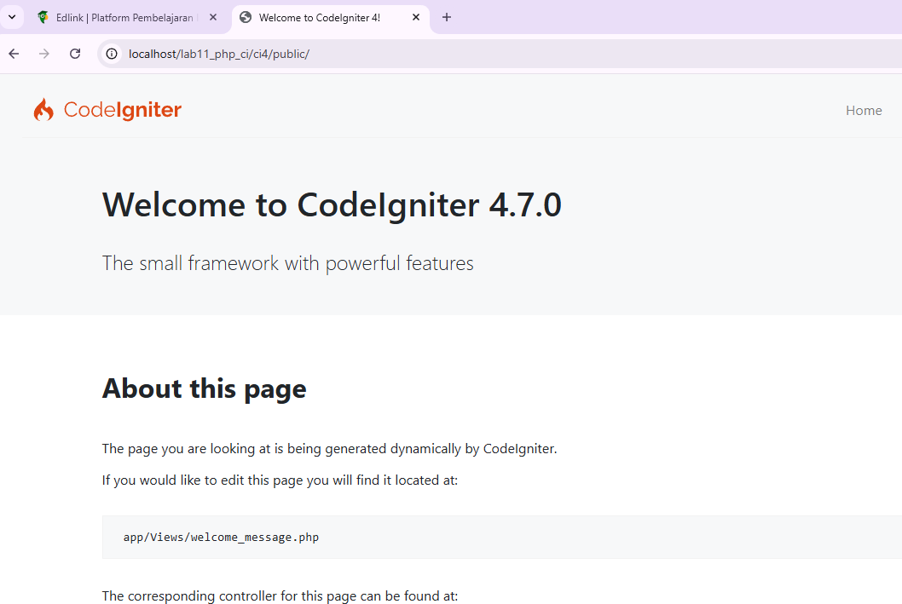

### Menjalankan CLI (Command Line Interface)
Untuk mengakses CLI buka terminal/command prompr. Arahkan lokasi direktori sesuai dengan direktori kerja project dibuat (xampp/htdocs/lab11_ci/ci4).
Perintah yang dapat dijalankan untuk memanggil CLI Codeigniter adalah:
```
php spark
```


### Mengaktifkan Mode Debugging
Codeigniter 4 menyediakan fitur debugging untuk memudahkan developer untuk mengetahui pesan error apabila terjadi kesalahan dalam membuat kode program. 
Secara default fitur ini belum aktif. Ketika terjadi error pada aplikasi akan ditampilkan pesan kesalahan seperti berikut. 

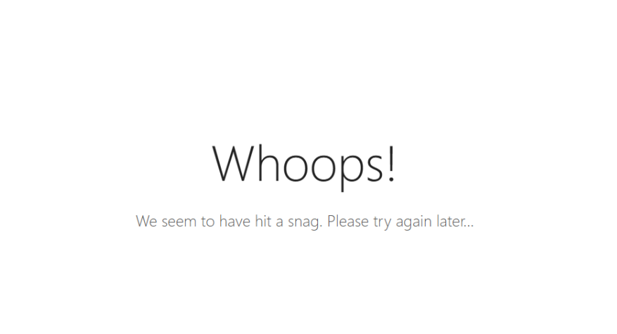

Ubah nama file env menjadi .env kemudian buka file tersebut dan ubah nilai variable CI_ENVIRINMENT menjadi development. 


### Struktur Direktori
Fokus kita pada folder app, dimana folder tersebut adalah area kerja kita untuk membuat aplikasi. Dan folder public untuk menyimpan aset web seperti css, gambar, javascript, dll. 

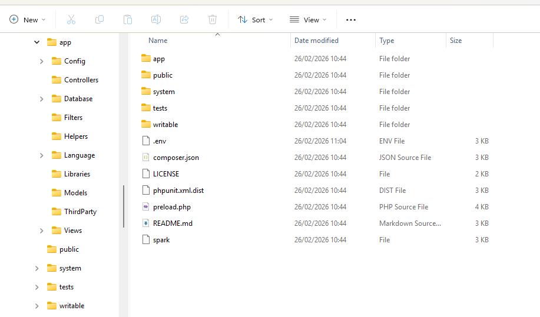

### Routiing dan Controller
Router terletak pada file app/config/Routes.php 
```php
$routes->get('/', 'Home::index'); 
```
#### Membuat Route Baru
```php
$routes->get('/about', 'Page::about'); 
$routes->get('/contact', 'Page::contact'); 
$routes->get('/faqs', 'Page::faqs'); 
```

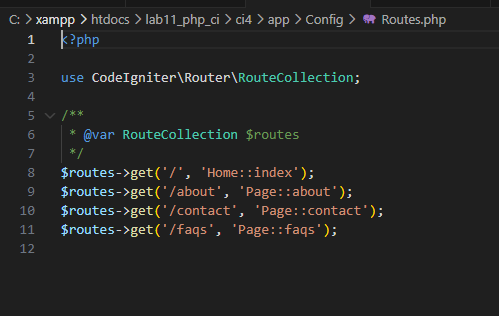

Untuk mengetahui route yang ditambahkan sudah benar, buka CLI dan jalankan perintah barikut
```
php spark routes 
```
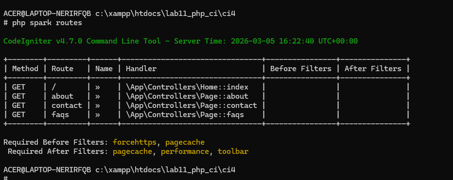

Selanjutnya coba akses route yang telah dibuat dengan mengakses alamat url http://localhost:8080/about 

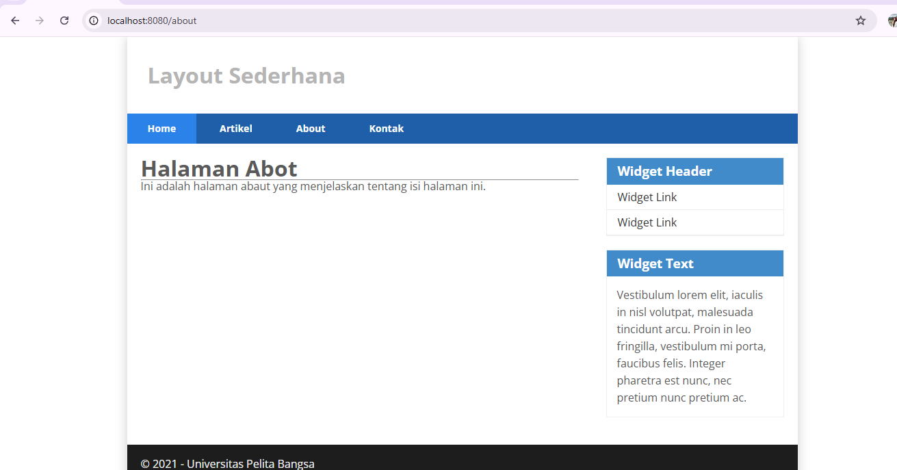

Ketika diakses akan mucul tampilan error 404 file not found, itu artinya file/page tersebut tidak ada. Untuk dapat mengakses halaman tersebut, harus dibuat terlebih dahulu Contoller yang sesuai dengan routing yang dibuat yaitu Contoller Page. 

#### Membuat Controller
```php
<?php 

namespace App\Controllers; 

class Page extends BaseController 
{ 
    public function about() 
    { 
        echo "Ini halaman About";
    } 

    public function contact() 
    { 
        echo "Ini halaman Contact"; 
    }
    
    public function faqs() 
    { 
        echo "Ini halaman FAQ"; 
    } 

    public function tos()
    { 
        echo "Ini halaman Terms of Service"; 
    }
}
```
Refresh kembali halaman browser.

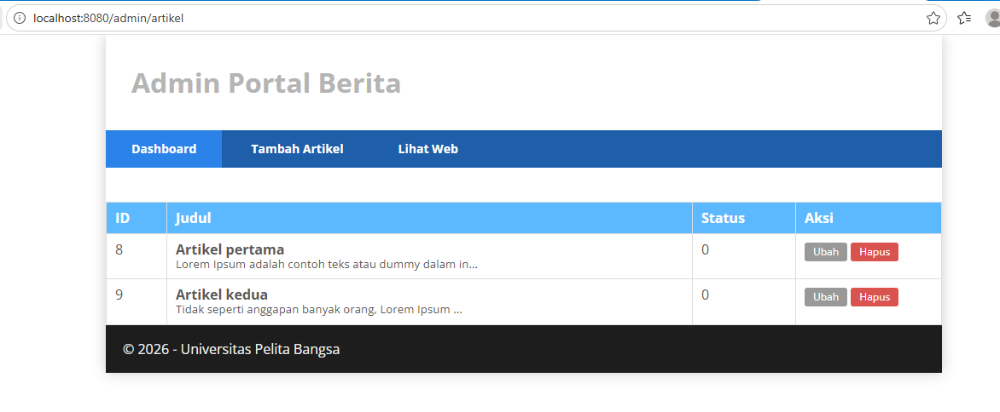

#### Auto Routing
Secara default fitur autoroute pada Codeiginiter sudah aktif. Untuk mengubah status autoroute dapat mengubah nilai variabelnya. Untuk menonaktifkan ubah nilai true menjadi false. 
```php
$routes->setAutoRoute(true); 
```
Tambahkan method baru pada Controller Page seperti berikut. 
```php
public function tos() 
{ 
    echo "ini halaman Term of Services"; 
} 
```
Method ini belum ada pada routing, sehingga cara mengaksesnya dengan menggunakan alamat: http://localhost:8080/page/tos  

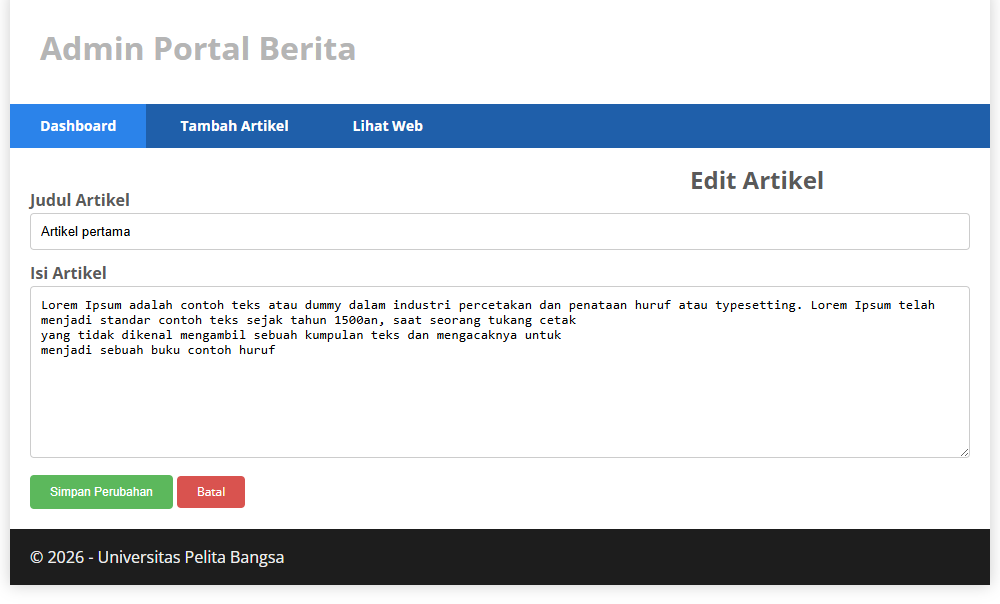

### Membuat View
```html
<!DOCTYPE html> 
<html lang="en"> 
<head> 
    <meta charset="UTF-8"> 
    <title><?= $title; ?></title> 
</head> 
<body> 
    <h1><?= $title; ?></h1> 
    <hr> 
    <p><?= $content; ?></p> 
</body> 
</html> 
```
Ubah method about pada class Controller Page menjadi seperti berikut: 
```php
public function about() 
{ 
    return view('about', [ 
        'title' => 'Halaman Abot', 
        'content' => 'Ini adalah halaman abaut yang menjelaskan tentang isi halaman ini.' 
    ]); 
}
```
Setelah itu refresh halaman itu.

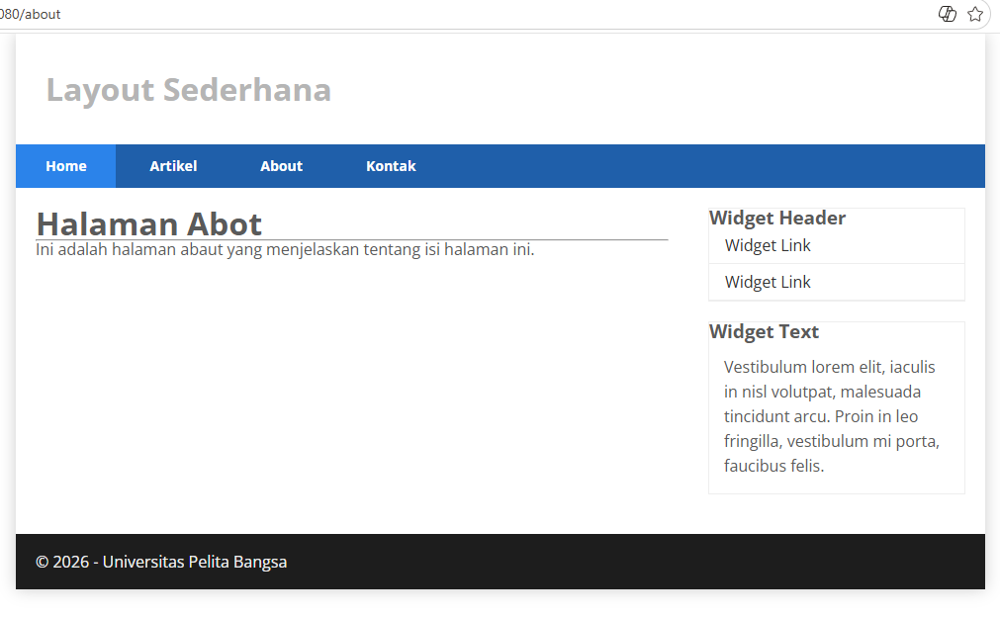

### Membuat Layout Web dengan CSS
uat file css pada direktori public dengan nama style.css (copy file dari praktikum lab4_layout). Kita akan gunakan layout yang pernah dibuat pada praktikum 4. 
```css
/* import google font */
@import
url('https://fonts.googleapis.com/css2?family=Open+Sans:ital,wght@0,300;0,400;0,600;0,700;0,800;1,300;1,400;1,600;1,700;1,800&display=swap');
@import
url('https://fonts.googleapis.com/css2?family=Open+Sans+Condensed:ital,wght@0,300;0,700;1,300&display=swap');
/* Reset CSS */
* {
    margin: 0;
    padding: 0;
}

body {
    line-height:1;
    font-size:100%;
    font-family:'Open Sans', sans-serif;
    color:#5a5a5a;
}

#container {
    width: 980px;
    margin: 0 auto;
    box-shadow: 0 0 1em #cccccc;
}

/* header */
    header {
    padding: 20px;
}
header h1 {
    margin: 20px 10px;
    color: #b5b5b5;
}

/* navigasi */
nav {
    display: block;
    background-color: #1f5faa;
}

nav a{
    padding: 15px 30px;
    display: inline-block;
    color: #ffffff;
    font-size: 14px;
    text-decoration: none;
    font-weight: bold;
}

nav a.active,
nav a:hover {
    background-color: #2b83ea;
}

/* Hero Panel */
#hero {
    background-color: #e4e4e5;
    padding: 50px 20px;
    margin-bottom: 20px;
}

#hero h1 {
    margin-bottom: 20px;
    font-size: 35px;
}

#hero p {
    margin-bottom: 20px;
    font-size: 18px;
    line-height: 25px;
}

#main {
    float: left;
    width: 640px;
    padding: 20px;
}

/* sidebar area */
#sidebar {
    float: left;
    width: 260px;
    padding: 20px;
}

/* widget */
.widget-box {
    border:1px solid #eee;
    margin-bottom:20px;
 }
.widget-box .title {
    padding:10px 16px;
    background-color:#428bca;
    color:#fff;
}
    .widget-box ul {
    list-style-type:none;
}
    .widget-box li {
    border-bottom:1px solid #eee;
}
.widget-box li a {
    padding:10px 16px;
    color:#333;
    display:block;
    text-decoration:none;
}
.widget-box li:hover a {
    background-color:#eee;
}
.widget-box p {
    padding:15px;
    line-height:25px;
}

/* footer */
footer {
    clear: both;
    background-color: #1d1d1d;
    padding: 20px;
    color: #eee;
}

/* box */
.box {
    display:block;
    float:left;
    width:33.333333%;
    box-sizing:border-box;
    -moz-box-sizing:border-box;
    -webkit-box-sizing:border-box;
    padding:0 10px;
    text-align:center;
}
.box h3 {
    margin: 15px 0;
}
.box p {
    line-height: 20px;
    font-size: 14px;
    margin-bottom: 15px;
}
box img {
    border: 0;
    vertical-align: middle;
}
.image-circle {
    border-radius: 50%;
}
.row {
    margin: 0 -10px;
    box-sizing: border-box;
    -moz-box-sizing: border-box;
    -webkit-box-sizing: border-box;
}
.row:after, .row:before,
.entry:after, .entry:before {
    content:'';
    display:table;
}
.row:after,
.entry:after {
    clear:both;
}

.divider {
    border:0;
    border-top:1px solid #eeeeee;
    margin:40px 0;
    }
/* entry */
.entry {
    margin: 15px 0;
}
    .entry h2 {
    margin-bottom: 20px;
}
.entry p {
    line-height: 25px;
}
.entry img {
    float: left;
    border-radius: 5px;
    margin-right: 15px;
}
.entry .right-img {
    float: right;
}

/* Bagian About */
.about-section {
    padding: 40px 20px;
}

.about-section h2 {
    color: #1f5faa;
    margin-bottom: 15px;
}

.about-section p {
    font-size: 18px;
    color: #555;
    line-height: 1.6;
    margin-bottom: 30px;
    max-width: 800px;
}

.portfolio {
    display: flex;
    flex-wrap: wrap;
    justify-content: center;
    gap: 20px;
}

.portfolio-item {
    background-color: #f4f6fa;
    border: 1px solid #e0e0e0;
    border-radius: 8px;
    text-align: center;
    padding: 20px;
    width: 280px;
    transition: all 0.3s ease;
}

.portfolio-item:hover {
    transform: translateY(-5px);
    box-shadow: 0 4px 10px rgba(0,0,0,0.1);
}

.portfolio-item img {
    width: 100%;
    max-width: 220px;
    border-radius: 8px;
    margin-bottom: 10px;
}

.portfolio-item h4 {
    color: #1f5faa;
    margin-bottom: 8px;
    font-size: 18px;
}

.portfolio-item p {
    font-size: 18px;
    color: #666;
    line-height: 1.5;
}

/* Bagian Kontak */
.contact-section {
    padding: 40px 20px;
}

.contact-section h2 {
    color: #1f5faa;
    margin-bottom: 10px;
}

.contact-section p {
    color: #555;
    margin-bottom: 25px;
    font-size: 16px;
}

.contact-form {
    max-width: 500px;
    margin: 0 auto;
    background-color: #f4f6fa;
    border: 1px solid #e0e0e0;
    border-radius: 8px;
    padding: 25px 30px;
}

.contact-form label {
    display: block;
    font-weight: bold;
    color: #333;
    margin-bottom: 5px;
}

.contact-form input,
.contact-form textarea {
    width: 100%;
    padding: 10px;
    border: 1px solid #ccc;
    border-radius: 5px;
    margin-bottom: 15px;
    font-size: 14px;
}

.contact-form textarea {
    resize: vertical;
}

.contact-form button {
    background-color: #1f5faa;
    color: #fff;
    border: none;
    padding: 10px 18px;
    border-radius: 5px;
    cursor: pointer;
    font-size: 15px;
    transition: 0.3s;
}

.contact-form button:hover {
    background-color: #2b83ea;
}

/* Responsif */
@media (max-width: 768px) {
    .portfolio {
        flex-direction: column;
        align-items: center;
    }

    .portfolio-item {
        width: 90%;
    }

    .contact-form {
        width: 90%;
        padding: 20px;
    }
}
```

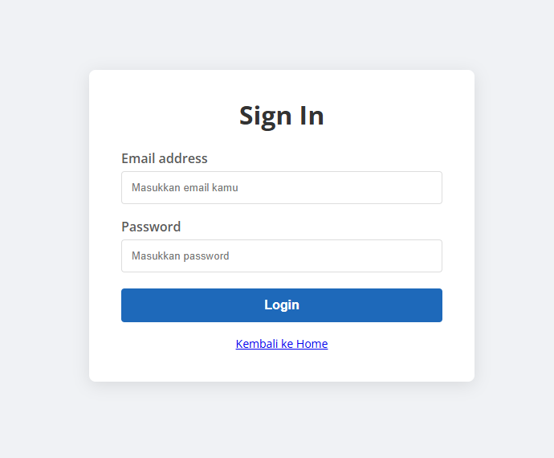

Kemudian buat folder template pada direktori view kemudian buat file header.php dan footer.php

File app/view/template/header.php
```html
<!DOCTYPE html> 
<html lang="en"> 
<head> 
    <meta charset="UTF-8"> 
    <title><?= $title; ?></title> 
    <link rel="stylesheet" href="<?= base_url('/style.css');?>"> 
</head> 
<body> 
    <div id="container"> 
    <header> 
        <h1>Layout Sederhana</h1> 
    </header> 
    <nav> 
        <a href="<?= base_url('/');?>" class="active">Home</a> 
        <a href="<?= base_url('/artikel');?>">Artikel</a> 
        <a href="<?= base_url('/about');?>">About</a> 
        <a href="<?= base_url('/contact');?>">Kontak</a> 
    </nav> 
    <section id="wrapper"> 
        <section id="main"> 
```
File app/view/template/footer.php
```php
        </section> 
        <aside id="sidebar"> 
            <div class="widget-box"> 
                <h3 class="title">Widget Header</h3> 
                <ul> 
                    <li><a href="#">Widget Link</a></li> 
                    <li><a href="#">Widget Link</a></li> 
                </ul> 
            </div> 
            <div class="widget-box"> 
                <h3 class="title">Widget Text</h3> 
                <p>Vestibulum lorem elit, iaculis in nisl volutpat, 
malesuada tincidunt arcu. Proin in leo fringilla, vestibulum mi porta, 
faucibus felis. Integer pharetra est nunc, nec pretium nunc pretium ac.</p> 
            </div> 
        </aside> 
    </section> 
    <footer> 
        <p>&copy; 2021 - Universitas Pelita Bangsa</p> 
    </footer> 
    </div> 
</body> 
</html> 
```
Kemudian ubah file app/view/about.php
```php
<?= $this->include('template/header'); ?> 
 
<h1><?= $title; ?></h1> 
<hr> 
<p><?= $content; ?></p> 
 
<?= $this->include('template/footer'); ?> 
```
Selanjutnya refresh tampilan pada alamat http://localhost:8080/about 

 

# Praktikum 2: Framework Lanjutan (CRUD)

## Tujuan 
1. Mahasiswa mampu memahami konsep dasar Model.
2. Mahasiswa mampu memahami konsep dasar CRUD.
3. mahasiswa mampu membuat program sederhana menggunakan Frameowrk Codeigniter4.

## Langkah - langkah Praktikum
### 1. Membuat Database dan Tabel
```
CREATE DATABASE lab_ci4; 

CREATE TABLE artikel ( 
    id INT(11) auto_increment, 
    judul VARCHAR(200) NOT NULL, 
    isi TEXT, 
    gambar VARCHAR(200), 
    status TINYINT(1) DEFAULT 0, 
    slug VARCHAR(200), 
    PRIMARY KEY(id) 
);
```

### 2. Konfigurasi koneksi database
Pada praktikum ini kita gunakan konfigurasi pada file .env.

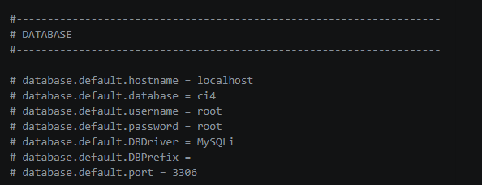 

### 3. Membuat Model 
Selanjutnya adalah membuat model untuk memproses data Artikel. BUat file baru pada ditektori **app/Models** dengan nama **ArtikelModel.php**
```php
<?php 
 
namespace App\Models; 
 
use CodeIgniter\Model; 
 
class ArtikelModel extends Model 
{ 
    protected $table = 'artikel'; 
    protected $primaryKey = 'id'; 
    protected $useAutoIncrement = true; 
    protected $allowedFields = ['judul', 'isi', 'status', 'slug', 
'gambar']; 
 
} 
```

### 4. Membuat Controller
BUat Controller baru dengna nama **Artikel.php** pada ditekrori **app/Controllers**.
```php
<?php 
 
namespace App\Controllers; 
 
use App\Models\ArtikelModel; 
 
class Artikel extends BaseController 
{ 
    public function index()  
    { 
        $title = 'Daftar Artikel'; 
        $model = new ArtikelModel(); 
        $artikel = $model->findAll(); 
        return view('artikel/index', compact('artikel', 'title')); 
    } 
}    
```

### 5. Membuat View
Buat direktori baru dengan nama **artikel** pada direktori **app/views**, kemudian buat file baru 
dengan nama **index.php**.  
```php
<?= $this->include('template/header'); ?> 

<?php if($artikel): foreach($artikel as $row): ?> 
<article class="entry"> 
    <h2<a href="<?= base_url('/artikel/' . $row['slug']);?>"><?= 
$row['judul']; ?></a> 
</h2> 
    " alt="<?= 
$row['judul']; ?>"> 
    <p><?= substr($row['isi'], 0, 200); ?></p> 
</article> 
<hr class="divider" /> 
<?php  endforeach; else: ?> 
<article class="entry"> 
    <h2>Belum ada data.</h2> 
</article> 
<?php endif; ?> 

<?= $this->include('template/footer'); ?> 
```
Selanjutnya buka browser kembali, dengan mengakses urs http://localhost:8080/artikel  

 

Belum ada data yang diampilkan. Kemudian coba tambahkan beberapa data pada database agar dapat ditampilkan datanya. 
```
INSERT INTO artikel (judul, isi, slug) VALUE  
('Artikel pertama', 'Lorem Ipsum adalah contoh teks atau dummy dalam industri percetakan dan penataan huruf atau typesetting. Lorem Ipsum telah menjadi standar contoh teks sejak tahun 1500an, saat seorang tukang cetak yang tidak dikenal mengambil sebuah kumpulan teks dan mengacaknya untuk menjadi sebuah buku contoh huruf.', 'artikel-pertama'),  
('Artikel kedua', 'Tidak seperti anggapan banyak orang, Lorem Ipsum 
bukanlah teks-teks yang diacak. Ia berakar dari sebuah naskah sastra latin klasik dari era 45 sebelum masehi, hingga bisa dipastikan usianya telah mencapai lebih dari 2000 tahun.', 'artikel-kedua'); 
```
Refresh kembali browser

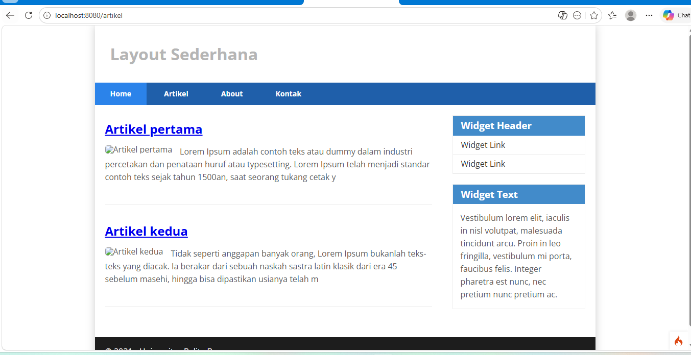 

### 6. Membuat Tampilan DEtail Artikel
Tampilan pada saat judul berita di klik maka akan diarahkan ke halaman yang berbeda. Tambahkan fungsi baru pada **Controller Artikel** dengan nama **view()**. 
```php
    public function view($slug) 
    { 
        $model = new ArtikelModel(); 
        $artikel = $model->where([ 
            'slug' => $slug 
        ])->first(); 
 
        // Menampilkan error apabila data tidak ada. 
        if (!$artikel)  
        { 
            throw PageNotFoundException::forPageNotFound(); 
        } 
 
        $title = $artikel['judul']; 
        return view('artikel/detail', compact('artikel', 'title')); 
    } 
```

### 7. Membuat View Detail
 Buat view baru untuk halaman detail dengan nama **app/views/artikel/detail.php**. 
 ```php
<?= $this->include('template/header'); ?> 

<article class="entry"> 
    <h2><?= $artikel['judul']; ?></h2> 
    " alt="<?= $artikel['judul']; ?>"> 
    <p><?= $row['isi']; ?></p> 
</article> 

<?= $this->include('template/footer'); ?> 
 ```

 ### 7. Membuat Routing Untuk Artikel Detail
 Buka Kembali file **app/config/Routes.php**, kemudian tambahkan routing untuk artikel detail. 
```php
$routes->get('/artikel/(:any)', 'Artikel::view/$1'); 
```

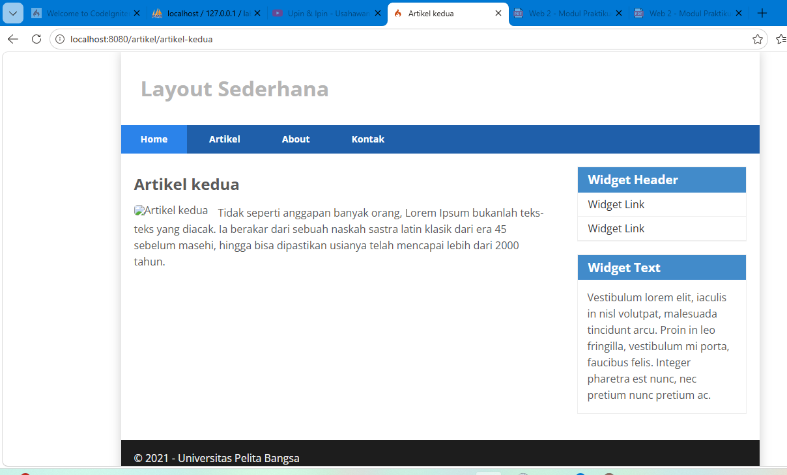

### 8. Membuat Menu Admin
Menu admin adalah untuk proses CRUD data artikel. Buat method baru pada **Controller Artikel** dengan nama **admin_index()**.  
```php
    public function admin_index()  
    { 
        $title = 'Daftar Artikel'; 
        $model = new ArtikelModel(); 
        $artikel = $model->findAll(); 
        return view('artikel/admin_index', compact('artikel', 'title')); 
    } 
```
Selanjutnya buat view untuk tampilan admin dengan nama **admin_index.php** 
```php
<?= $this->include('template/admin_header'); ?> 
 
<table class="table"> 
    <thead> 
        <tr> 
            <th>ID</th> 
            <th>Judul</th> 
            <th>Status</th> 
            <th>AKsi</th> 
        </tr> 
    </thead> 
    <tbody> 
    <?php if($artikel): foreach($artikel as $row): ?> 
    <tr> 
        <td><?= $row['id']; ?></td> 
        <td> 
            <b><?= $row['judul']; ?></b> 
            <p><small><?= substr($row['isi'], 0, 50); ?></small></p> 
        </td> 
        <td><?= $row['status']; ?></td> 
        <td> 
            <a class="btn" href="<?= base_url('/admin/artikel/edit/' . 
$row['id']);?>">Ubah</a> 
            <a class="btn btn-danger" onclick="return confirm('Yakin 
menghapus data?');" href="<?= base_url('/admin/artikel/delete/' . 
$row['id']);?>">Hapus</a> 
        </td> 
    </tr> 
    <?php  endforeach; else: ?> 
    <tr> 
        <td colspan="4">Belum ada data.</td> 
    </tr> 
    <?php endif; ?> 
    </tbody> 
    <tfoot> 
        <tr> 
            <th>ID</th> 
            <th>Judul</th> 
            <th>Status</th> 
            <th>AKsi</th> 
        </tr> 
    </tfoot> 
</table> 
 
<?= $this->include('template/admin_footer'); ?> 
```
Tambahkan routing untuk menu admin seperti berikut:
```php
$routes->group('admin', function($routes) { 
    $routes->get('artikel', 'Artikel::admin_index'); 
    $routes->add('artikel/add', 'Artikel::add'); 
    $routes->add('artikel/edit/(:any)', 'Artikel::edit/$1'); 
    $routes->get('artikel/delete/(:any)', 'Artikel::delete/$1'); 
});
```
Akses meni admin dengan url http://localhost:8080/admin/artikel  


### 9. Menambahkan Data Artikel
Tambahkan fungsi/method baru pada **Controller Artikel** dengan nama **add()**. 
```php
    public function add()  
    { 
        // validasi data. 
        $validation =  \Config\Services::validation(); 
        $validation->setRules(['judul' => 'required']); 
        $isDataValid = $validation->withRequest($this->request)->run();

        if ($isDataValid) 
        { 
            $artikel = new ArtikelModel(); 
            $artikel->insert([ 
                'judul' => $this->request->getPost('judul'), 
                'isi' => $this->request->getPost('isi'), 
                'slug' => url_title($this->request->getPost('judul')), 
            ]); 
            return redirect('admin/artikel'); 
        } 
        $title = "Tambah Artikel"; 
        return view('artikel/form_add', compact('title'));  
    } 
```
Kemudian buat vies untuk from tambah dengan nama **form_add.php**
```php
<?= $this->include('template/admin_header'); ?> 

<h2><?= $title; ?></h2> 
<form action="" method="post"> 
    <p> 
        <input type="text" name="judul"> 
    </p> 
    <p> 
        <textarea name="isi" cols="50" rows="10"></textarea> 
    </p> 
    <p><input type="submit" value="Kirim" class="btn btn-large"></p> 
</form>

<?= $this->include('template/admin_footer'); ?> 
```

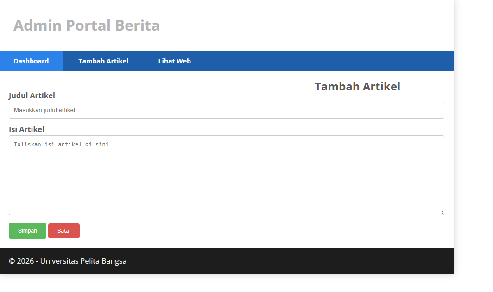

### 10. Mengubah Data
Tambahkan fungsi/method baru pada **Controller Artikel** dengan nama **edit()**. 
```php
    public function edit($id)  
    { 
        $artikel = new ArtikelModel(); 
 
        // validasi data. 
        $validation =  \Config\Services::validation(); 
        $validation->setRules(['judul' => 'required']); 
        $isDataValid = $validation->withRequest($this->request)->run(); 
 
        if ($isDataValid) 
        { 
            $artikel->update($id, [ 
                'judul' => $this->request->getPost('judul'), 
                'isi' => $this->request->getPost('isi'), 
            ]); 
            return redirect('admin/artikel'); 
        } 
 
        // ambil data lama 
        $data = $artikel->where('id', $id)->first(); 
        $title = "Edit Artikel"; 
        return view('artikel/form_edit', compact('title', 'data')); 
    } 
```
Kemudian buat view untuk form tambah dengan nama **form_edit.php**
```php
<?= $this->include('template/admin_header'); ?> 
 
<h2><?= $title; ?></h2> 
<form action="" method="post"> 
    <p> 
        <input type="text" name="judul" value="<?= $data['judul'];?>" > 
    </p> 
    <p> 
        <textarea name="isi" cols="50" rows="10"><?= 
$data['isi'];?></textarea> 
    </p> 
    <p><input type="submit" value="Kirim" class="btn btn-large"></p> 
</form> 
 
<?= $this->include('template/admin_footer'); ?> 
```


### 11. Menghapus Data
Tambahkan fungsi/method baru pada **Controller Artikel** dengan nama **delete()**.
```php
    public function delete($id)  
    { 
        $artikel = new ArtikelModel(); 
        $artikel->delete($id); 
        return redirect('admin/artikel'); 
    } 
```

# Praktikum 3: View Layout dan View Cell

## Tujuan 
Setelah menyelesaikan praktikum ini, mahasiswa diharapkan dapat: 
1. Memahami konsep View Layout di CodeIgniter 4. 
2. Menggunakan View Layout untuk membuat template tampilan. 
3. Memahami dan mengimplementasikan View Cell dalam CodeIgniter 4. 
4. Menggunakan View Cell untuk memanggil komponen UI secara modular. 

## Langkah - langkah Praktikum
### 1. Membuat Layput Utama
Buat folder **layout** di dalam **app/Views/**
BUat file **main.php** di dalam folder **layout** dengan kode berikut:
```html

<!DOCTYPE html>
<html lang="en">
<head>
    <meta charset="UTF-8">
    <title><?= $title ?? 'Portal Berita' ?></title>
    <link rel="stylesheet" href="<?= base_url('/style.css');?>">
</head>
<body>
    <div id="container">
        <header><h1>Layout Sederhana</h1></header>
        <nav>
            <a href="<?= base_url('/'); ?>">Home</a>
            <a href="<?= base_url('/artikel'); ?>">Artikel</a>
        </nav>
        <section id="wrapper">
            <section id="main">
                <?= $this->renderSection('content') ?> 
            </section>
            <aside id="sidebar">
                <?= view_cell('\App\Cells\ArtikelTerkini::render') ?>
                
                <div class="widget-box">
                    <h3 class="title">Widget Header</h3>
                    <p>Isi widget lainnya...</p>
                </div>
            </aside>
        </section>
        <footer><p>&copy; 2026 Universitas Pelita Bangsa</p></footer>
    </div>
</body>
</html>
```

### 2. Modifikasi File View
Ubah **app/Views/home.php** agar sesuai dengan layout baru:
```php
<?= $this->extend('layout/main') ?> 
 
<?= $this->section('content') ?> 
 
<h1><?= $title; ?></h1>  
<hr>  
<p><?= $content; ?></p>  
 
<?= $this->endSection() ?> 
```
Sesuaikan juga untuk halaman lainnya yang ingin menggunakan format layout yang baru.

### 3. Menampilkan Data Dinamis dengan Views Cell
View Cell adalah fitur yang memungkinkan pemanggilan tampilan dalam bentuk komponen yang dapat digunakan ulang. Cocok digunakan untuk elemen-elemen yang sering muncul di berbagai halaman seperti sidebar, widget, atau menu navigasi. 
### 4. Membuat Class View Cell
Buat folder **Cells** di dalam **app/**
BUat file **ArtikelTerkini.php** di dalam **app/Cells/** denga kode berikut:
```php
<?php 
 
namespace App\Cells; 
 
use CodeIgniter\View\Cell; 
use App\Models\ArtikelModel; 
 
class ArtikelTerkini extends Cell 
{ 
    public function render() 
    { 
        $model = new ArtikelModel(); 
        $artikel = $model->orderBy('created_at', 'DESC')->limit(5)->findAll(); 
         
        return view('components/artikel_terkini', ['artikel' => $artikel]); 
    } 
}
```

### 5. Membuat View untuk View Cell
Buat folder **components** di dalam **app/Views/**
Buat file **artikel_terkini.php** di dalam **app/Views/components/** dengan kode:
```php
<h3>Artikel Terkini</h3> 
<ul> 
    <?php foreach ($artikel as $row): ?> 
    <li><a href="<?= base_url('/artikel/' . $row['slug']) ?>"><?= 
$row['judul'] ?></a></li> 
    <?php endforeach; ?> 
</ul> 
```

## Pertanyaan dan Tugas 
• Apa manfaat utama dari penggunaan View Layout dalam pengembangan aplikasi? 
**Jawab**
Manfaat utama dari penggunaan View Layout dalam pengembangan aplikasi adalah meningkatkan efisiensi dan konsistensi kode melalui prinsip pengulangan komponen yang terpusat. Dengan menerapkan sistem ini, pengembang cukup membuat satu kerangka utama untuk elemen yang bersifat tetap seperti header, navigasi, dan footer, sehingga tidak perlu menuliskan kode yang sama berulang kali di setiap halaman. Selain mempercepat proses pembangunan aplikasi, struktur ini sangat memudahkan proses pemeliharaan karena setiap perubahan desain atau penambahan asset global hanya perlu dilakukan pada satu file layout induk untuk memperbarui seluruh tampilan aplikasi secara otomatis.

• Jelaskan perbedaan antara View Cell dan View biasa. 
**Jawab**
**View Biasa** adalah komponen tampilan yang alurnya dikendalikan sepenuhnya oleh Controller. Ketika Anda mengakses sebuah URL, Controller akan mengambil data dari Model, lalu mengirimkan data tersebut ke View untuk ditampilkan. View biasa tidak bisa berdiri sendiri karena ia sangat bergantung pada instruksi dan data yang diberikan oleh Controller pendampingnya.
**View Cell** adalah komponen UI modular yang bersifat mandiri. Berbeda dengan View biasa, View Cell memiliki logic atau kelas sendiri untuk mengambil datanya sendiri tanpa harus melalui Controller utama halaman tersebut. Hal ini memungkinkan View Cell untuk dipanggil di mana saja—seperti di dalam layout, sidebar, atau halaman lain—hanya dengan satu baris kode, tanpa perlu mengubah kode pada Controller di setiap halaman tempat ia muncul.

# Praktikum 4: Framework Lanjutan (Modul Login)

## Tujuan 
1. Mahasiswa mampu memehami konsep dasar Auth dan Filter.
2. Mahasiswa mampu memahami konsep dasar LOgin System.
3. Mahasiswa mampu membuat modul logim menggunaka Frameworl Codeigniter 4.

## Langkah - langkah Praktikum
### 1. Membuat Tabel User
```SQL
CREATE TABLE user ( 
  id INT(11) auto_increment, 
  username VARCHAR(200) NOT NULL, 
  useremail VARCHAR(200), 
  userpassword VARCHAR(200), 
  PRIMARY KEY(id) 
); 
```

### 2. Membuat Modul User
Selanjutnya adalah membuat Model untuk memproses data Login. Buat file baru pada direktori **app/Models** dengan nama **UserModel.php**

```php
<?php

namespace App\Models;

use CodeIgniter\Model;

class UserModel extends Model
{
    protected $table = 'user';
    protected $primaryKey = 'id';
    protected $useAutoIncrement = true;
    protected $allowedFields = ['username', 'useremail', 'userpassword'];
}
```

### 3. Membuat Controller User
Buat Controller baru dengan nama **User.php** pada direktori **app/Controllers**. Kemudian tambahkan method **index()** untuk menampilkan daftar user, dan method **login()** untuk proses login. 
```php
<?php

namespace App\Controllers;

use App\Models\UserModel;

class User extends BaseController
{
    public function index()
    {
        $title = 'Daftar User';
        $model = new UserModel();
        $users = $model->findAll();
        return view('user/index', compact('users', 'title'));
    }

    public function login()
    {
        helper(['form']);
        $email = $this->request->getPost('email');
        $password = $this->request->getPost('password');

        if (!$email) {
            return view('user/login');
        }

        $session = session();
        $model = new UserModel();
        $login = $model->where('useremail', $email)->first();

        if ($login) {
            if (password_verify($password, $login['userpassword'])) {

                $session->set([
                    'user_id' => $login['id'],
                    'user_name' => $login['username'],
                    'user_email' => $login['useremail'],
                    'logged_in' => TRUE,
                ]);

                return redirect()->to('/admin/artikel');
            } else {
                $session->setFlashdata("flash_msg", "Password salah.");
                return redirect()->to('/user/login');
            }
        } else {
            $session->setFlashdata("flash_msg", "Email tidak terdaftar.");
            return redirect()->to('/user/login');
        }
    }

    public function logout()
    {
        session()->destroy();
        return redirect()->to('/user/login');
    }
}
```

### 4. Membuat View Login
Buat direktori baru dengan nama **user** pada direktori **app/views**, kemudian buat file baru dengan nama **login.php**.  
```html
<!DOCTYPE html>
<html lang="en">
<head>
    <meta charset="UTF-8">
    <title>Login</title>
    <link rel="stylesheet" href="<?= base_url('style.css'); ?>">
</head>
<body>

<div id="login-wrapper">
    <h1>Sign In</h1>

    <?php if(session()->getFlashdata('flash_msg')): ?>
        <div class="alert">
            <?= session()->getFlashdata('flash_msg') ?>
        </div>
    <?php endif; ?>

    <form method="post">
        <label>Email</label>
        <input type="email" name="email" class="form-control" required>

        <label>Password</label>
        <input type="password" name="password" class="form-control" required>

        <button type="submit" class="btn">Login</button>
    </form>
</div>

</body>
</html>
```

### 5. Membuat Database Seeder
Untuk membuat database seeder untuk label user. Buka CLI, kemudia tulis perintah berikut;
```
php spark make:seeder UserSeeder
```
Selanjutnya, buka file **UserSeeder.php** yang berada di lokasi direktori **/app/Database/Seeds/UserSeeder.php** kemudian isi dengann kode berikut:
```php
<?php

namespace App\Database\Seeds;

use CodeIgniter\Database\Seeder;

class UserSeeder extends Seeder
{
    public function run()
    {
        $model = model('UserModel');

        $model->insert([
            'username' => 'admin',
            'useremail' => 'admin@email.com',
            'userpassword' => password_hash('admin123', PASSWORD_DEFAULT),
        ]);
    }
}
```
Selanjutnya buka kembali CLI dan ketik perintah berikut:
```
php spark db:seed UserSeeder
```

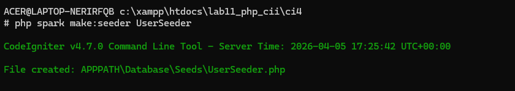


### 6. Menambahkan Auth Filter 
Selanjutnya membuat filterr untuk halaman admin. Buat file dengan nama **Auth.php** pada direktori **app/Filters**.
```php
<?php

namespace App\Filters;

use CodeIgniter\Filters\FilterInterface;
use CodeIgniter\HTTP\RequestInterface;
use CodeIgniter\HTTP\ResponseInterface;

class Auth implements FilterInterface
{
    public function before(RequestInterface $request, $arguments = null)
    {
        if (!session()->get('logged_in')) {
            return redirect()->to('/user/login');
        }
    }

    public function after(RequestInterface $request, ResponseInterface $response, $arguments = null)
    {
    }
}
```
Selanjutnya buka file **app/Config/Filters.php**
```php
'auth' => \App\Filters\Auth::class,  
```

Selanjutnya buka file **app/Config/Routes.php** dan sesuaikan kodenya.

### 7. Percobaan Akses Menu Admin
Buka url dengan alamat http://localhost:8080/admin/artikel ketika alamat tersebut diakses maka, akan dimunculkan halaman login.


### 8. Fungsi LOgout
Tambahkan method logout pada Controller User seperti berikut:
```php
public function logout()
{
    session()->destroy();
    return redirect()->to('/user/login');
}
```


# Praktikum 5

## 🚀 Fitur Terbaru 
* [cite_start]**Pagination:** Membatasi tampilan data agar tidak terlalu panjang, diset sebanyak 10 record per halaman[cite: 22].
* [cite_start]**Pencarian (Filtering):** Fitur untuk mencari artikel berdasarkan judul menggunakan kata kunci tertentu[cite: 71, 84].
* [cite_start]**Persistent Search:** Pencarian tetap tersimpan saat berpindah halaman navigasi (pagination)[cite: 98].

---

## 🛠️ Langkah-Langkah Praktikum 5

### 1. Implementasi Pagination & Pencarian di Controller
[cite_start]Modifikasi pada method `admin_index` di `Artikel.php` untuk menangani pengambilan variabel query `q` dan penggunaan method `paginate()`[cite: 15, 74].

### 2. Update Tampilan Admin
* [cite_start]Menambahkan form pencarian dengan method `GET` sebelum tabel data[cite: 90, 94].
* [cite_start]Menambahkan navigasi `pager` di bawah tabel untuk berpindah halaman[cite: 29, 30].

---

## 📸 Dokumentasi Praktikum

### Tampilan Pagination
[cite_start]Pagination memecah tampilan menjadi beberapa halaman tergantung banyaknya data yang ditampilkan pada setiap halaman[cite: 13, 66].
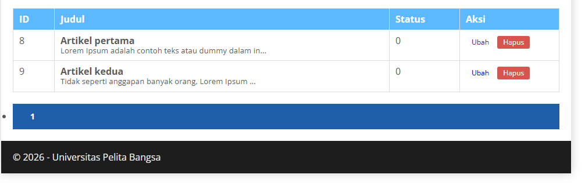

### Tampilan Fitur Pencarian
[cite_start]Pencarian data digunakan untuk memfilter data berdasarkan judul yang diinputkan user[cite: 71, 135].
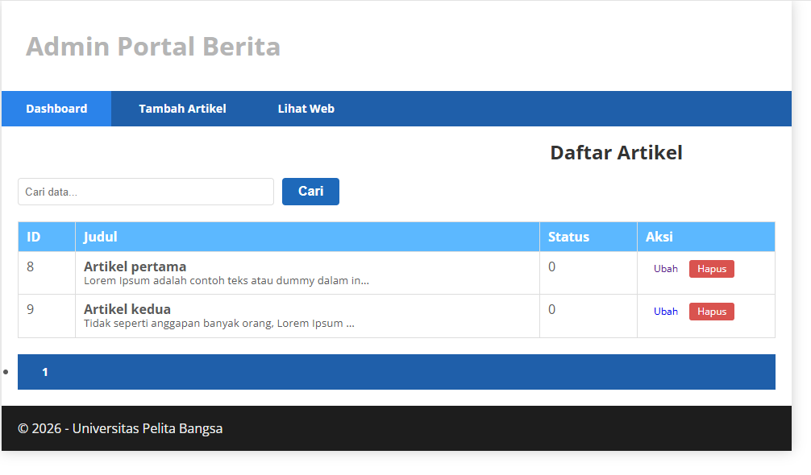

---

## 💻 Cara Menjalankan
1. Pastikan server lokal menyala (`php spark serve`).
2. Akses halaman admin di `localhost:8080/admin/artikel`.
3. Gunakan kolom pencarian untuk memfilter data.
4. [cite_start]Jika data lebih dari 10, navigasi halaman akan muncul di bawah tabel[cite: 22].

---
[cite_start]**Instansi:** Universitas Pelita Bangsa [cite: 32]  
[cite_start]**Mata Kuliah:** Pemrograman Web 2 [cite: 1]
